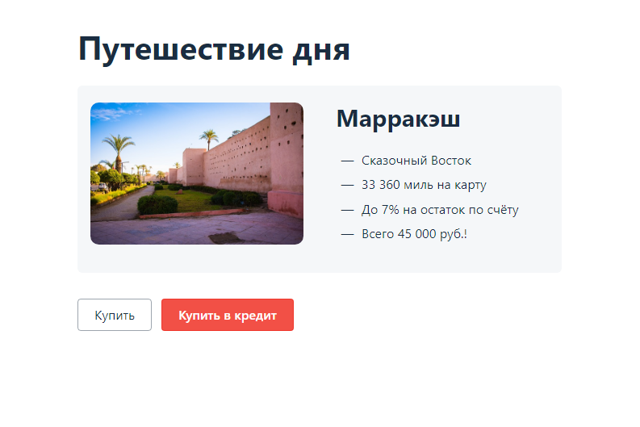
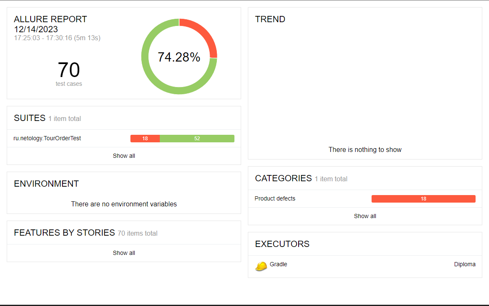

# Отчет о тестировании

## Краткое описание задачи

Выполнено автоматизированное тестирование приложения - веб-сервиса, который предлагает купить тур по определённой цене
двумя способами:

- оплата по дебетовой карте;
- выдача кредита по данным банковской карты.

Внешний вид стартовой страницы сервиса:

По результату прогона автотестов сформирован слудующий отчет Allure:

## Количество тест-кейсов: 70

## Процент успешных и не успешных тест-кейсов: 74.28/25.72

## Общие рекомендации:

1. Доработать функции обязательности заполненности полей: "Номер карты", "Месяц", "Год", "CVС/CVV";
2. Доработать проверку по допустимому виду и количеству вводимых символов для поля "Владелец";
3. Доработать функцию обработки платежа и покупки в кредит в случае ввода неактивной карты;
4. Доработать проверку при вводе значения в поле "Месяц": недопустимо значение 00;
5. Исправить орфографическую ошибку в названии города на стартовой странице сервиса;
6. Привести формат даты операции, записываемой в базу данные в поля created к корректному часовому поясу;